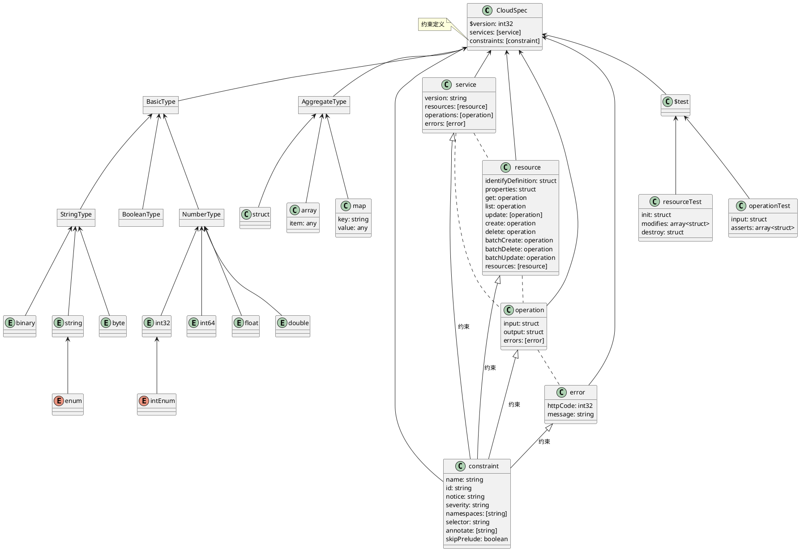

### 概览


CloudSpec模型由基本类型、复合类型、服务类型、选择器、约束组成，用Interface Define Language的方式描述云产品的服务、资源、OpenAPI及各配套能力的关系。模型支持自动转换为Resource/RAM/OpenAPI Meta及反转。

### 组成
组成CloudSpec的每个类型称之为Component。



### Component ID ABNF
```json
ComponentId =
    RootComponentId [ComponentIdMember];

RootComponentId =
    AbsoluteRootComponentId / Identifier;

AbsoluteRootComponentId =
    Namespace "#" Identifier;

Namespace =
    Identifier *("." Identifier);

Identifier =
    IdentifierStart *IdentifierChars;

IdentifierStart =
    (1*"_" (ALPHA / DIGIT)) / ALPHA;

IdentifierChars =
    ALPHA / DIGIT / "_";

ComponentIdMember =
    "$" Identifier;

ALPHA = %x41-5A / %x61-7A;

DIGIT = %x30-39;
```

### Component ID 组成说明
#### 跨namespace的引用表达
```json
$version: 1
namespace: a.b
struct A {
  B: a.c#D
}
```

示例中的B引用的是a.cnamespace下的名称为D的component。component的类型可以是基本类型、复合类型、服务类型。

:::warning
特别注意，如果引用本地的对象，namespace可以省略，但#不可省略。

:::

#### 带属性的引用
```json
$version: 1
namespace: a.b

struct A1 {
  A11: int32
  A12: string
}

struct A {
  B: string
  B1: A1
}

map M {
  key: string
  value: A
}

array ArrayA {
  item: A1
}
```

在a.c中引用的格式如下：

```json
$version: 1
namespace: a.c
// 需要显示的导入namespace为a.b的文件
import "./ab.cspec"

struct AC {
  // 这里a的类型为int32
  a: a.b#A1$A11
  // 这里b的类型和a.b下的map M是一致的，也是一个map类型
  b: a.b#M
  // 这里c的类型和a.b下的map M的value的类型一致，是一个struct A的类型
  c: a.b#M$value 
  // 这里d的类型其实是a.b夏的A1的A11结构
  d: a.b#ArrayA$item/A11
}
```

