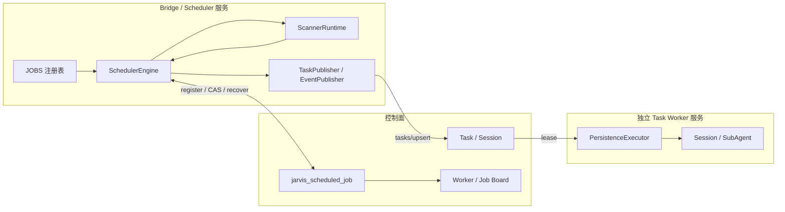
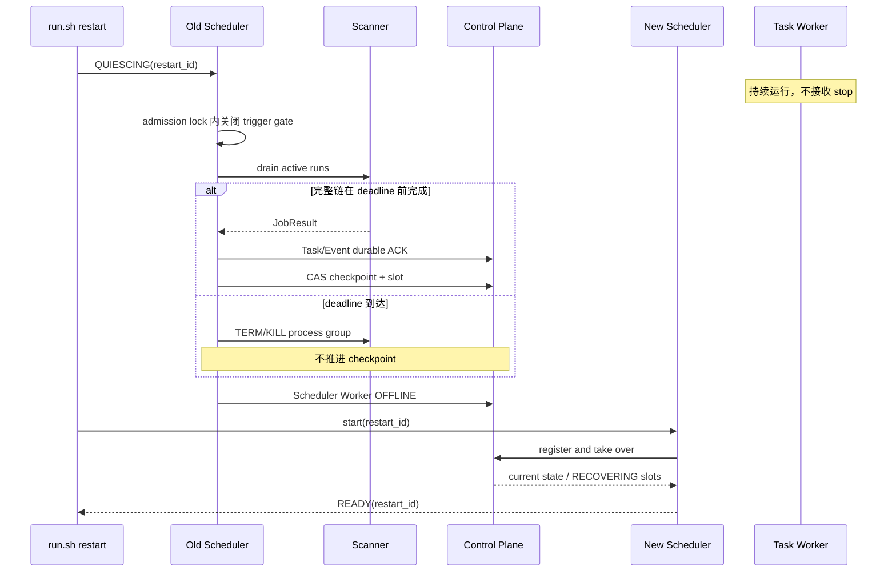

# Bridge 定时任务模块重构设计

> 2026-07-20 · 设计 v14 · 待评审
>
> 本版以 `origin/master@a44f934` 为唯一现状基线，取代 v1–v13 及
> `worktree-scheduler-refactor-design` 两条分叉方案。旧分支中的模型、注册表和
> `TriggerPlanner` 仅作为实现参考，不代表已进入主干或生产。

## 1. 结论

本次重构采用以下收敛方案：

1. Bridge 内只保留一个常驻 `SchedulerEngine`，所有时间驱动任务都通过显式 `JOBS` 注册表调度。
2. 调度器只运行扫描或可重放维护，不直接执行需要长期恢复的业务工作；业务工作继续写入现有 Task 控制面。
3. `PersistenceExecutor` 从 Bridge 拆成独立 Task Worker 服务。只有拆分完成后，才允许承诺 Bridge restart 不会终止正在运行的 Session/SubAgent。
4. job 定义、当前 slot、checkpoint、状态、最近结果和 `next_run_at` 保存到控制面单行当前态，供恢复与 Board 展示；不新增 run 历史表。
5. restart 采用 `QUIESCING → drain Scanner → Scheduler OFFLINE → 新实例 READY` 协议；Task Worker 不在 Bridge restart 的操作范围内。
6. Aone、Aone Reply、PR 生命周期均保持 at-least-once：先持久化 Task 或事件 WAL，再推进 checkpoint，禁止用内存状态作为完成依据。
7. Probe 继续是一次性 Ephemeral 作业，不扩展为 `probe_finding` Task；它受统一 Scheduler 管理，但不占用持久 Task Worker。

本轮只交付设计，不修改现有调度实现、控制面或运行入口。

## 2. 范围与非目标

### 2.1 目标

- 统一 interval、daily、adaptive 三类时间语义。
- 统一 job 注册、校验、并发、防重入、超时、重试、checkpoint 和可观测性。
- restart 后恢复未完成 slot，不丢 Aone/PR 更新，不制造重复业务副作用。
- Board 可查看所有 job 的周期、当前状态、最近结果和下一次执行时间。
- 新增 job 时只增加 job 定义、runner 和契约测试，不再复制 daemon loop。

### 2.2 非目标

- 不实现运行时动态注册、热 reload、多 Bridge 选主或跨主机迁移。
- 不把 Scanner run 建模为 Task、Session 或独立 Worker。
- 不新增 `scheduled_job_run` 历史表。
- 不改变现有 Task/Session 的业务状态机。
- 不把 Board、Executor 或人工触发命令注册成定时 job。
- 不在本次设计中把 Probe finding 持久化为 Task。

## 3. 当前主干基线

### 3.1 运行组件

当前 Bridge 是同一进程内的 6 个组件，其中 4 个组件各自维护调度线程：

| 当前组件 | 当前职责 | 当前时间/状态真源 | restart 行为 |
| --- | --- | --- | --- |
| `AoneScheduler` | 查询 `assignedTo ∪ tracker ∪ idle-tagged work items`；生成 `ticket` Task；低频检查 stale claim | 内存 snapshot、tick count；Task 控制面以 `desired_revision` 幂等 | 重启后全量重扫；Task upsert 收敛重复 |
| `DailyScheduler` | `nudge@09:00`、`probe@10:00` | `.my-day/bridge/daily-scheduler.json`；仅配置小时内到期 | 本地日期 marker 防当天重复；错过整小时不补跑 |
| `AoneReplyScheduler` | 查询控制面 `SUSPENDED + AONE_REPLY` Session；新评论生成 `wake` Task | 控制面 wait/cursor；内存仅用于轮询节流 | 可从控制面重建，不依赖本地 wait 文件 |
| `PrWatchScheduler` | PR 查询、CI/评论 Task、finish/comment/event 生命周期处理 | `.my-day/bridge/pr-watch.json`、Task 控制面、Aone/DingTalk 双 ledger | 本地 registry/cursor 与 ledger 跨重启恢复 |
| `PersistenceExecutor` | Worker 注册、heartbeat、Task lease、Session/SubAgent 生命周期 | Task/Session 控制面 | 与 Bridge 同进程；stop 会终止活动 Task 并转 retryable |
| `EphemeralExecutor` | 本地一次性作业，包括 probe | 进程内 inflight；部分结果写本地文件 | restart 时终止，不承诺跨重启去重 |

启动顺序是：

```text
PersistenceExecutor
→ AoneScheduler
→ DailyScheduler
→ AoneReplyScheduler
→ PrWatchScheduler
```

### 3.2 已完成的结构收敛

- 原 `PersonaScheduler` 已并入 `AoneScheduler` 的 assignee/tracker/idle 并集查询，不再是独立任务。
- 原 Scan、Revisit、Probe、WaitWatcher、ManagedWaitSensor、Reconcile、Board 等旧类已不再构成主干现状。
- 可恢复 Aone Reply 等待已经以控制面 Session/wait cursor 为真源。
- Task upsert、Worker/Session fencing、lease 和 retryable stop 已存在。
- PR 与每日任务已恢复本地持久状态，避免纯内存状态在 restart 后丢失。

### 3.3 尚未实现的能力

- 没有 `SchedulerEngine`、`JOBS` 注册表或统一时间循环。
- 没有 scheduled-job 控制面表/API、slot/checkpoint CAS 或 Scheduler Worker fencing。
- 没有 quiesce、Scanner drain、restart ID 或 READY 握手。
- Task Worker 尚未独立；Bridge restart 会中断活动 Session/SubAgent。
- `PrWatchScheduler` 仍混合 discovery、Task 生产和生命周期副作用。
- Daily 和 PR 状态仍依赖本地 JSON 文件，Board 无法统一展示 job 状态。

因此，当前只能保证“已持久化 Task 可重新 lease”，不能保证“Bridge restart 期间业务 Session 不中断”。

## 4. 目标架构



组件生命周期严格分离：

- Scheduler 服务：Bridge 入口、job 时间计算、Scanner 生命周期、job 状态提交。
- Scanner：由 Scheduler 创建的有界子进程或 handler；允许在 restart deadline 到达时终止。
- Task Worker：独立进程和 supervisor；只消费控制面 Task，不由 `bridge/run.sh restart` 停止。

## 5. 统一 Job 清单

v14 只迁移当前主干真实存在的时间驱动职责，不复活已删除组件：

| job id | 类型 | 目标 runner | 产物与副作用 | 迁移来源 |
| --- | --- | --- | --- | --- |
| `aone.scan` | interval / discovery | handler | 生成稳定 identity 的 `ticket` Task | `AoneScheduler` 主循环 |
| `aone.stale_claim` | interval / maintenance | command | 只发布有稳定 event key 的 stale 告警 | `AoneScheduler` 隐式 sub-tick |
| `daily.nudge` | daily / maintenance | handler | 通过现有双 ledger 发布幂等提醒 | `DailyScheduler` nudge |
| `daily.probe` | daily / discovery | headless | 一次性 Ephemeral 结果；不生成持久 Task | `DailyScheduler` probe |
| `aone.reply` | adaptive / discovery | handler | 生成稳定 identity 的 `wake` Task | `AoneReplyScheduler` |
| `pr.watch` | adaptive / discovery | handler | 生成 `pr_ci_fix` / `pr_comment_reply` Task，并把生命周期 intent 写入 durable ledger | `PrWatchScheduler` 查询与判断 |
| `pr.lifecycle` | adaptive / maintenance | handler | 消费 durable intent，执行 finish/comment/event 幂等发布与补偿 | `PrWatchScheduler` 生命周期副作用 |

约束：

- Persona 已合并进 `aone.scan`，不得再注册 `persona.*` job。
- Board 是 scheduled-job 当前态的消费者，不是定时 job。
- Executor 是执行基础设施，不是定时 job。
- `aone.stale_claim` 必须显式注册，禁止继续隐藏为第 N 次 scan 的 sub-tick。
- `daily.nudge` 和 `daily.probe` 必须拆成两个 definition，分别展示 next due 和结果。
- `pr.watch` 只发现变化和持久化 intent，`pr.lifecycle` 只消费 ledger；二者不得在同一 runner 中重新混合。

## 6. Job 开发契约

### 6.1 Definition

每个 `ScheduledJobDefinition` 必须声明：

| 字段 | 约束 |
| --- | --- |
| `id` | 稳定唯一，格式 `<domain>.<action>`，发布后不可复用 |
| `revision` | 正整数；扫描、输出或 checkpoint 契约变化时递增 |
| `description` | 明确扫描对象、目的和产物 |
| `purpose` | `DISCOVERY` 或 `MAINTENANCE` |
| `schedule` | interval、daily、adaptive 三选一 |
| `runner` | command、headless、handler 三选一 |
| `timeout_seconds` | 正数 |
| `retry_delay_seconds` | 可重试失败后重跑同一 slot 的间隔 |
| `replay_policy` | `TASK_UPSERT_IDEMPOTENT`、`EVENT_LEDGER_IDEMPOTENT` 或 `EPHEMERAL` |
| `enabled_env` | 可选，只在 start/restart 时读取 |
| `checkpoint_upgrade` | `RESET_FULL`、`RESET_OVERLAP` 或 `MIGRATE` |

job 模块 import 时不得启动线程、访问网络、sleep 或写文件。`validate_registry()` 必须先把 iterable 单次物化为有序 tuple，校验后返回同一个 tuple；`load_jobs()` 直接返回校验结果。

### 6.2 Runner

| runner | 场景 | 约束 |
| --- | --- | --- |
| command | 确定性脚本或 CLI | argv 数组、workspace key、环境变量白名单；禁止 shell 字符串 |
| headless | 需要模型判断的扫描 | 固定 prompt builder、结果协议和 session policy |
| handler | 有界 Python 查询 | 显式 handler key；不得自行建线程或 sleep |

除 `EPHEMERAL` job 外，runner 不得直接启动业务 SubAgent。Discovery 结果应转换为持久 Task；Maintenance 外部副作用必须由现有 ledger 或等价 outbox 幂等保护。

### 6.3 Result

`JobResult` 固定包含：

- `status`：`SUCCEEDED`、`RETRYABLE_FAILURE`、`PERMANENT_FAILURE`。
- `observations`：仅成功结果允许非空。
- `checkpoint`：仅成功结果允许提供。
- `next_due_at`：仅 adaptive 的成功结果允许提供，且必须带时区。
- `error`：失败必填，成功禁止携带。

失败结果不得携带 observations、checkpoint 或新的 slot。协议非法时不发布 Task、不提交 checkpoint，并记录为永久协议错误。

## 7. 时间、slot 与失败语义

所有时间使用带时区 datetime；持久化统一使用 UTC，daily 的自然日固定为 `Asia/Shanghai`。

- interval：使用绝对计划序列。当前 slot 成功后，选择第一个严格晚于 `completed_at` 的计划时刻；不从完成时间重新计时。
- daily：当天到点后可补跑，直到该自然日 slot 成功；不得保留“仅配置小时内执行”的现状限制，也不追补更早自然日。
- adaptive：成功结果可给出 `next_due_at`；缺失时使用 default delay。超出 min/max 边界是协议错误，禁止静默 clamp。
- retryable failure：保留当前 slot，按 `retry_delay_seconds` 重试。
- permanent failure：保留当前 slot，清空 retry due，等待更高 revision 或人工恢复。

slot key 固定由以下三元组生成：

```text
job_id + definition_revision + scheduled_for_utc
```

revision 升级不得复用旧 slot identity。旧分支的 `TriggerPlanner` 可移植为无 I/O 纯函数，但必须补齐 revision、失败状态和 adaptive 越界约束后才能使用；它本身不等于 `SchedulerEngine`。

## 8. 状态所有权与迁移

### 8.1 最终状态所有权

| 状态 | 最终真源 |
| --- | --- |
| definition、status、current slot、checkpoint、next due、最近结果 | `jarvis_scheduled_job` |
| Aone/PR 发现后的业务工作 | 现有 Task/Session 控制面 |
| Aone Reply 等待与 comment cursor | 现有 Session/wait 控制面 |
| Aone/DingTalk 发布去重与失败补偿 | 现有双事件 ledger；等价控制面 outbox 上线前不得删除 |
| Bridge pause | 本地运维开关，可保留 |
| PID、restart ID、READY | 本地进程握手文件，不作为业务恢复真源 |

`jarvis_scheduled_job` 一行代表一个已注册 job，同时保存 job 定义和当前运行状态。
详细属性统一放入 `definition` JSON；看板、调度和恢复需要频繁查询的字段单独展开：

| 字段 | 类型 | 含义与更新规则 |
| --- | --- | --- |
| `id` | `BIGINT` | 数据库自增主键，不参与调度 identity |
| `job_key` | `VARCHAR(128)` | 稳定 job ID，例如 `aone.scan`，全表唯一 |
| `job_name` | `VARCHAR(256)` | 看板展示名称 |
| `definition` | `LONGTEXT` | definition JSON：revision、description、schedule、runner、timeout、retry 和 replay policy |
| `enabled` | `TINYINT` | 是否允许调度；未出现在本次完整注册中的历史 job 置为 `0`，不删除 |
| `status` | `VARCHAR(32)` | `IDLE`、`RUNNING`、`RECOVERING`、`ERROR`、`DISABLED` |
| `next_run_at` | `DATETIME(3)` | 下次正常执行或失败重试时间；运行中、永久失败和禁用时为空 |
| `current_slot` | `VARCHAR(256)` | 当前计划批次，使用 `job_key + revision + scheduled_for_utc`；重试和恢复复用原值 |
| `current_worker_id` | `VARCHAR(128)` | 当前有权提交该 slot 结果的 Scheduler 实例 |
| `lease_expire_at` | `DATETIME(3)` | 当前 Scheduler 所有权到期时间；过期的 `RUNNING` 可由新实例接管 |
| `checkpoint` | `LONGTEXT` | 最近成功提交的扫描进度 JSON |
| `last_started_at` | `DATETIME(3)` | 最近一次开始执行时间 |
| `last_finished_at` | `DATETIME(3)` | 最近一次成功或失败结束时间 |
| `last_error` | `VARCHAR(2048)` | 最近错误摘要，不保存凭证或完整业务载荷 |
| `version` | `BIGINT` | CAS 乐观锁和旧实例 fencing；抢占、完成、失败、接管和启停时递增 |
| `gmt_create` / `gmt_modified` | `DATETIME(3)` | 注册时间和最后更新时间 |

建表定义固定为：

```sql
CREATE TABLE jarvis_scheduled_job (
  id BIGINT NOT NULL AUTO_INCREMENT,
  job_key VARCHAR(128) NOT NULL COMMENT '稳定 job ID',
  job_name VARCHAR(256) NOT NULL COMMENT '看板展示名称',
  definition LONGTEXT NOT NULL COMMENT 'job definition JSON',

  enabled TINYINT NOT NULL DEFAULT 1 COMMENT '是否允许调度',
  status VARCHAR(32) NOT NULL DEFAULT 'IDLE'
    COMMENT 'IDLE/RUNNING/RECOVERING/ERROR/DISABLED',
  next_run_at DATETIME(3) NULL COMMENT '下次执行或重试时间',

  current_slot VARCHAR(256) NULL COMMENT '当前计划批次',
  current_worker_id VARCHAR(128) NULL COMMENT '当前 Scheduler 实例',
  lease_expire_at DATETIME(3) NULL COMMENT '执行所有权过期时间',

  checkpoint LONGTEXT NULL COMMENT '已提交的扫描进度 JSON',
  last_started_at DATETIME(3) NULL COMMENT '最近开始时间',
  last_finished_at DATETIME(3) NULL COMMENT '最近完成时间',
  last_error VARCHAR(2048) NULL COMMENT '最近错误摘要',

  version BIGINT NOT NULL DEFAULT 0 COMMENT 'CAS 与 fencing 版本',
  gmt_create DATETIME(3) NOT NULL DEFAULT CURRENT_TIMESTAMP(3),
  gmt_modified DATETIME(3) NOT NULL DEFAULT CURRENT_TIMESTAMP(3)
    ON UPDATE CURRENT_TIMESTAMP(3),

  PRIMARY KEY (id),
  UNIQUE KEY uk_job_key (job_key),
  KEY idx_schedule (enabled, status, next_run_at),
  KEY idx_worker (current_worker_id, status)
);
```

`definition` 示例：

```json
{
  "revision": 1,
  "description": "扫描工作项并生成持久化 Task",
  "schedule": {"type": "interval", "seconds": 1800},
  "runner": {"type": "handler", "key": "aone.scan"},
  "timeoutSeconds": 300,
  "retryDelaySeconds": 30,
  "replayPolicy": "TASK_UPSERT_IDEMPOTENT"
}
```

状态字段按以下规则更新：

| 场景 | `status` | `next_run_at` | `current_slot` | `current_worker_id` | `lease_expire_at` | `version` |
| --- | --- | --- | --- | --- | --- | --- |
| 首次注册 | `IDLE` | 首次计划时间 | `NULL` | `NULL` | `NULL` | `0` |
| 到期抢占 | `RUNNING` | `NULL` | 设置稳定 slot | 设置实例 ID | 设置租约 | `+1` |
| 运行心跳 | `RUNNING` | `NULL` | 不变 | 不变 | 延长租约 | 不变 |
| 成功完成 | `IDLE` | 下次计划时间 | `NULL` | `NULL` | `NULL` | `+1` |
| 可重试失败 | `ERROR` | 重试时间 | 保留原 slot | `NULL` | `NULL` | `+1` |
| 重试 | `RUNNING` | `NULL` | 复用原 slot | 设置新实例 | 设置新租约 | `+1` |
| 租约过期接管 | `RECOVERING` | `NULL` | 复用原 slot | 替换为新实例 | 设置新租约 | `+1` |
| 永久失败 | `ERROR` | `NULL` | 保留原 slot | `NULL` | `NULL` | `+1` |
| 禁用 | `DISABLED` | `NULL` | `NULL` | `NULL` | `NULL` | `+1` |

不新增 run-history 表；历史运行明细继续由日志和 Task/Session 时间线承担。

### 8.2 本地状态迁移

迁移必须采用“导入、双读校验、切换、延迟删除”，禁止先删本地文件：

1. `DailyScheduler` 的日期 marker 导入 `daily.nudge`、`daily.probe` 各自 checkpoint。
2. `pr-watch.json` 的 registry、cursor 和 dedupe 状态导入 `pr.watch` checkpoint。
3. 迁移期旧 loop 和新 job 不得同时触发；每个 job 使用独立 enable gate 原子切换。
4. 连续两个完整周期对账一致后，停止读取旧状态文件。
5. 双事件 ledger 在等价 durable outbox 验收前继续保留，不能随 scheduler 状态文件一起删除。

## 9. Task 与事件不丢失契约

### 9.1 Aone scan

- 冷启动允许全量重扫。
- `task_key` 与 `desired_revision` 必须稳定；重复发现由 Task upsert 收敛。
- Task 全部明确 accepted 后才能推进 scan checkpoint。
- 网络超时或 ACK 未知时不推进 checkpoint，下一轮以相同 identity 重提。

### 9.2 Aone Reply

- 控制面 Session/wait cursor 是唯一真源。
- Scheduler checkpoint 只记录扫描进度，不能代替 wait cursor。
- restart 后重新分页查询全部 pending wait；相同评论生成相同 `wake` Task identity。

### 9.3 PR watch 与生命周期事件

- PR registry/cursor 迁入 job checkpoint；重复扫描生成相同 Task identity。
- finish、评论、Aone/DingTalk 通知必须先写带稳定 semantic event key 的 ledger/outbox，再允许推进 checkpoint。
- Aone 与 DingTalk 独立记账、独立重试；一个通道成功不得抑制另一个通道补偿。
- `post_uncertain` 只能查 marker，不得盲目重发。

### 9.4 Probe

- `daily.probe` 仍为 Ephemeral；restart 可以中断本轮。
- 未成功的 daily slot 不得标记完成，新 Scheduler 在当天窗口内补跑相同 slot。
- Probe 不使用 PersistenceExecutor，不引入 `probe_finding` Task。

## 10. 安全 restart

### 10.1 生效前置条件

以下条件全部完成前，`bridge/run.sh restart` 只能声明“可重租”，不能声明“Session 不间断”：

1. `PersistenceExecutor` 已迁出 `JarvisHandler`，由独立 `task_worker.py/task_worker.sh` 与 supervisor 管理。
2. Scheduler Scanner 容量与 Task Worker 容量静态分区，合计不超过机器预算。
3. Bridge stop/restart 不向 Task Worker 或其 sentinel 发送信号。
4. Task Worker 的启动、heartbeat、lease、stop 和 crash recovery 已独立验收。

### 10.2 正常 restart 协议



固定顺序：

1. 生成 restart ID，旧 Scheduler 进入 `QUIESCING`。
2. 在 admission lock 内关闭 trigger gate，不再启动新 Scanner。
3. 等待 active Scanner 完成“结果校验 → Task/Event durable ACK → job CAS”完整提交链。
4. deadline 到达后终止仍在运行的 Scanner 进程组；ACK 未知或 CAS 未完成时不推进 checkpoint。
5. 旧 Scheduler 标记 OFFLINE 并退出。
6. 新 Scheduler 事务性接管 job 行；遗留 RUNNING slot 转为 RECOVERING，从 committed checkpoint 重扫。
7. 只有收到相同 restart ID 的 READY，restart 才返回成功。

launchd 不得直接用 `kickstart -k` 跳过 quiesce/drain；必须先完成协议，再由 supervisor 拉起新进程。

### 10.3 Fencing

job 状态更新必须匹配：

```text
job_key + current_slot + current_worker_id + expected_version
```

除心跳续租外，每次成功 CAS 都递增 `version`。新 Worker 接管后，旧 Worker 的迟到结果、Task ACK 和 checkpoint 提交都必须被拒绝。

## 11. Board 与可观测性

控制面 Worker/运行状态页面增加 Scheduled Jobs 区域，每个 job 展示：

| 字段 | 展示要求 |
| --- | --- |
| job | id、description、revision、enabled |
| schedule | interval/daily/adaptive 摘要与时区 |
| current | `status`、`current_slot`、`current_worker_id`、`lease_expire_at` |
| next | `next_run_at`；永久失败或禁用时明确显示原因 |
| latest | `last_started_at`、`last_finished_at`、duration、`last_error` |
| recovery | checkpoint 摘要、RECOVERING 状态、`version` |

Board 只读控制面当前态，不通过轮询 Bridge 内存拼装，也不触发 job。

## 12. 代码结构

```text
bridge/
  run.sh
  main.py                         # Bridge/Scheduler composition root
  task_worker.py                  # 独立 Task Worker composition root
  task_worker.sh                  # 独立 supervisor 入口
  scheduler/
    model.py                      # definition / schedule / result
    planner.py                    # 纯时间计算 TriggerPlanner
    engine.py                     # 唯一 loop / admission / fencing
    runtime.py                    # ScannerRuntime / publishers
    jobs/
      __init__.py                 # 显式 JOBS 注册表
      aone_scan.py
      aone_stale_claim.py
      daily_nudge.py
      daily_probe.py
      aone_reply.py
      pr_watch.py
      pr_lifecycle.py
    tests/
      test_model.py
      test_registry.py
      test_planner.py
      test_engine.py
      test_runtime.py
      test_restart.py
      test_<job>.py
```

原子切换后，`jarvis_dingtalk_bot.py` 不再定义定时循环。钉钉事件入口与 Scheduler composition 可以同服务，但不得重新持有 Task Worker。

## 13. 实施阶段

主干当前只有 B0 完成；旧设计分支的 J1/J2 原型不计入实施状态。

| 阶段 | 当前状态 | 交付与完成门 |
| --- | --- | --- |
| B0 | 已完成 | 组件 10→6、Aone 并集探测、控制面 wait、PR/每日本地持久状态 |
| U1 | 未开始 | 模型、registry、修正后的纯 `TriggerPlanner` 及契约测试 |
| U2 | 未开始 | scheduled-job 表/API、Board 查询与 Scheduler Worker fencing |
| U3 | 未开始 | `SchedulerEngine`、ScannerRuntime、Task/Event publisher、fake clock 测试 |
| U4 | 未开始 | 导入 Daily/PR 本地状态；双读对账；保留事件 ledger |
| U5 | 未开始 | 逐项迁移 7 个 job；每项原子关旧开新，无双触发 |
| U6 | 未开始 | 独立 Task Worker/service 与静态容量分区 |
| U7 | 未开始 | quiesce/drain/OFFLINE/READY restart 协议 |
| U8 | 未开始 | 预发恢复验收、原子切换入口、清理旧 loop 与过期文档 |

执行顺序：

```text
U1 → U2 → U3 → U4 → U5 → U6 → U7 → U8
```

U6、U7、U8 完成前，禁止对外宣称 Bridge restart 保持业务 Session/SubAgent 不间断。

## 14. 测试与验收门

### 14.1 契约测试

- registry 重复 ID、revision/digest 不一致、非法 runner 和 import 副作用必须失败。
- fake clock 覆盖 interval、daily 补跑、adaptive 边界、misfire 和同 slot retry。
- slot identity 必须包含 revision；失败结果不得生成下一 slot。
- 同 job 禁止 overlap，不同 job 允许在容量内并发。
- Task/Event 未明确 durable ACK 时 checkpoint 不推进。
- state CAS 冲突、旧 Worker fence、控制面不可用必须 fail-closed。

### 14.2 迁移回归

- Aone 全量重扫不产生 Task storm，相同 `desired_revision` 幂等收敛。
- Aone Reply restart 后从控制面恢复全部等待与 cursor。
- Daily marker 导入后，当天不重复；错过整点可在当天补跑。
- PR registry/cursor 导入后不漏 PR；事件 ledger 重放不重复发布。
- Probe 中断后不标记成功，当天相同 slot 可再次运行。
- 每个迁移 job 都证明旧 loop 与新 job 不会同时触发。

### 14.3 Restart 验收

预发必须分别注入以下故障：

1. Scanner 扫描中 restart。
2. Task upsert 成功、job CAS 前 restart。
3. PR/Aone 事件写 ledger 后、发布前 restart。
4. Scheduler crash，无正常 OFFLINE。
5. 控制面短时不可用。
6. 多个业务 Session 运行时 Bridge restart。

通过标准：

- Scanner 从相同 slot 与 committed checkpoint 重扫。
- Aone/PR 更新没有被 checkpoint 越过。
- 重复 Task/事件由稳定 identity 收敛。
- 旧 Scheduler 的迟到提交被 fencing 拒绝。
- Task Worker PID、sentinel 和活动 Session 在 Bridge restart 前后保持不变。
- `run.sh restart` 只在新 Scheduler READY 后返回成功。

## 15. 评审问题的明确回答

1. **Board 如何看调度？** 读取 `jarvis_scheduled_job` 当前态，展示 job、周期、状态、最近结果和 next due；Board 本身不是 job。
2. **PersonaScheduler 与 ScanScheduler 是否合并？** 已合并。当前主干由 `AoneScheduler` 做 `assignedTo ∪ tracker ∪ idle-tagged work items` 并集探测；v14 只保留 `aone.scan`。
3. **Bridge restart 是否会杀 SubAgent？** 当前会。目标方案先拆独立 Task Worker，再让 restart 只 quiesce/drain Scheduler/Scanner；U6–U8 是硬门。
4. **Aone/PR 更新会不会在 restart 时丢失？** 目标保证不会被 checkpoint 越过：Task 或事件 ledger/outbox 必须先获得 durable ACK，再 CAS 提交 checkpoint；未知 ACK 使用相同 identity 重放。

## 16. 最终通过条件

方案实施完成必须同时满足：

1. 所有生产定时职责都来自唯一 `JOBS` 注册表，不存在隐藏 sub-tick 或自建永久调度线程。
2. 7 个 job 的 schedule、状态、next due、最近结果和恢复摘要可在 Board 查询。
3. slot、checkpoint、next due、owner 和 state version 由单行控制面当前态恢复。
4. Aone/PR discovery 使用 at-least-once 与稳定 Task identity；事件使用稳定 ledger/outbox key。
5. 任一未明确 durable ACK 的 Task/事件都不会被 checkpoint 越过。
6. Scheduler restart 可中断 Scanner，但会从相同 slot 和 committed checkpoint 恢复。
7. 独立 Task Worker 不被 Bridge restart 操作，活动 Session/SubAgent 实测不中断。
8. 旧 Worker 无法覆盖新 Worker 状态；新实例未 READY 时 restart 不成功。
9. Daily/PR 本地状态完成导入和双读对账后才停止读取；事件 ledger 在等价 outbox 上线前不删除。
10. 原子切换后无旧调度入口、双触发和过期架构文档。
