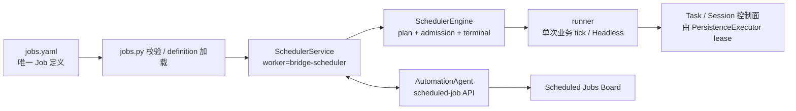

# Bridge 定时任务模块重构设计

> 2026-07-23 · 设计 v16 · 全量迁移实现基线

## 1. 结论

Bridge 的所有周期 Job 已由独立、单实例、fail-closed 的 `SchedulerService` 统一拥有。
它以固定 Worker `bridge-scheduler` 对接 AutomationAgent scheduled-job 控制面，负责
definition 注册、计划、slot 准入、执行、终态、心跳和有界停止。

`jarvis_dingtalk_bot.py` 不再构造或启动任何周期 Scheduler。周期业务由专用 runner
直接拥有，因此任一周期任务只有 SchedulerEngine 一个 cadence/admission 入口。

`JARVIS_BRIDGE_ROLE` 的边界：

- `scheduler`（唯一一台）：运行 `bridge/run.sh start`，作为 Task 执行器和全部周期 Job 的唯一调度器。
- `worker`（可多台）：只运行 `bridge/run.sh start`。Scheduler 会在启动前
  fail-closed，拒绝注册 Scheduler Worker 或执行任何 Job。
- 未知 role 同样被 `run.sh` 拒绝，不能回退为 scheduler。

## 2. 总体链路



- `SchedulerService` 先注册 ACTIVE Worker，再注册完整显式 definition、恢复 interrupted slot，
  最后才开始 tick；任一步无法确认就不调度。
- 同一 `job_key` 永不并发；不同 Job 最多使用 `JARVIS_SCHEDULER_MAX_CONCURRENCY`（默认 4）个槽位。
- `SchedulerEngine` 只信任控制面当前态；本地 cursor 仅服务业务逻辑，不能替代 Job 状态。
- `PersistenceExecutor` 仍是执行基础设施，不是 scheduled Job；scheduler 和 worker 角色都会启动它。

## 3. Job 定义与 runner 契约

唯一 Job 定义：`bridge/scheduler/jobs.yaml`。`jobs.py` 只负责严格校验、加载为运行时 definition；计划频率只在 YAML 中声明；旧的
`JARVIS_SCAN_INTERVAL`、`JARVIS_MANAGED_WAIT_SENSOR_SEC`、`JARVIS_CLAIM_HEALTH_INTERVAL_SEC`、
`JARVIS_PRWATCH_INTERVAL`、`JARVIS_EXTERNAL_RECOVERY_INTERVAL` 不再控制新 Scheduler cadence。
对应的 enable 开关仍是业务 kill switch，但不会改变控制面 definition。

每项定义显式给出稳定 `key`、`revision`、Board description、schedule、runner、misfire、
retry delay 与 `enabled`。`enabled:false` 仍注册到控制面，但状态为 `DISABLED`。

重新启用或变更任何执行语义必须提高 `revision`。所有持久化时间使用 UTC；daily 固定
`Asia/Shanghai`。slot identity 为：

```text
job_key + definition_revision + scheduled_for_utc
```

| schedule | 可用 misfire | 语义 |
| --- | --- | --- |
| `interval` | `COALESCE` | 停机期间合并为一个待执行 slot |
| `daily` | `CURRENT_DAY` | 只补当天计划，不追补历史自然日 |
| `adaptive` | `COALESCE`、`WAIT_FOR_COMPLETION` | 成功结果可提供下一次执行时间 |

handler runner 必须是有界的一次执行，禁止创建常驻线程或自行 sleep。headless runner 使用
`builder_ref/protocol/session_policy/lane` 的严格注册契约；无结果、协议不符、超时或重试耗尽均
fail-closed。`JobResult` 仅允许 `SUCCEEDED`、`RETRYABLE_FAILURE`、`PERMANENT_FAILURE`。

## 4. 全部 Job 清单

| job key | schedule | runner | 状态 | 一次执行内容 |
| --- | --- | --- | --- | --- |
| `daily.probe` | 每日 10:00 | `probe.daily/probe-result-v1` | 停用 | 独立 Terraform Headless 合成探测 |
| `aone.scan` | 30 分钟 | `aone.scan` | 启用 | Aone 并集扫描、Task 写入与状态观察 |
| `aone.claim-health` | 5 分钟 | `aone.claim-health` | 启用 | claimed 健康检查和事件 ledger 补偿 |
| `daily.nudge` | 每日 09:00 | `daily.nudge` | 启用 | Terraform idle 停滞双通道催办 |
| `aone.reply` | 30 秒 | `aone.reply` | 启用 | 人工 Aone 回复唤醒 SUSPENDED Session |
| `pr.watch` | adaptive，默认 1 小时 | `pr.watch` | 启用 | PR/CI/评审/合并生命周期；活跃时返回快档 next due |
| `external.recovery` | 5 分钟 | `external.recovery` | 启用 | 以 recovery token 只读核验不确定外部回执 |

`daily.probe` 是唯一刻意停用的 Job。其真实 Terraform 操作必须先取得明确业务授权；启用和再次
禁用都应提高 revision，且当天 10:00 后启用会按 `CURRENT_DAY` 补跑一次。

## 5. 周期职责映射

| 原循环 | 新 Job | 新 runner 做的事 | 保留的业务状态 |
| --- | --- | --- | --- |
| 领域职责 | 新 Job | runner | 保留的业务状态 |
| --- | --- | --- | --- |
| Aone 扫描 | `aone.scan` | `runners/scan.py` | 快照、Task 去重、事件 ledger |
| Claim 健康检查 | `aone.claim-health` | `runners/claim_health.py` | claim 观察与控制面 cursor |
| 每日催办 | `daily.nudge` | `runners/daily_nudge.py` | idle 选择与催办 event ledger |
| Aone 回复唤醒 | `aone.reply` | `runners/reply.py` | 仅本地 read throttle；控制面 wait cursor 为真源 |
| PR 生命周期 | `pr.watch` | `runners/pr_watch.py` | PR 注册表与 per-head 去重 |
| 外部回执收敛 | `external.recovery` | `runners/recovery.py` | recovery token、分页 cursor |

runner 不创建常驻线程或自行 sleep；daily slot 的幂等与补跑由控制面负责。

## 6. Worker、Board 与恢复

AutomationAgent 是 definition、当前状态、最近结果及 `next_run_at` 的真源。Bridge 经由：

```text
register → list/tick → start → complete | fail → recover-interrupted
```

对 scheduled-job API 交互。请求携带 `worker_key=bridge-scheduler` 和当前 `process_uuid`；旧进程、
重复启动、未知响应或 API 错误均视为不可确认。

Board 是只读观察面，不轮询 Bridge 内存也不能触发 Job。它展示 Worker 状态/心跳/已注册数，以及
每个 Job 的中文 description、revision、周期、计划时间和最近结果。当 Worker 不运行时，Board
必须提示“已登记计划不会执行，直到 scheduler 恢复”。

启动与停止：

```text
ACTIVE Worker → definition/runner 校验 → register → recover-interrupted → READY
停止 admission → DRAINING → 等待在途 future → OFFLINE
```

等待时间由 `JARVIS_SCHEDULER_DRAIN_TIMEOUT_SECONDS` 控制（默认 600 秒）。超时不 SIGKILL，
保留当前 Scheduler 继续 drain，拒绝启动替代实例。意外崩溃则由下一进程的
`recover-interrupted` 恢复控制面 slot，不承诺恢复 Python 栈或外部调用半进度。

## 7. 验收与运行方式

本次迁移已覆盖：

- 显式 `JOBS`、runner 装配和全部七个 Job definition 的一致性；
- interval/daily/adaptive 的计划、slot identity、retry 边界、同 Job 不并发与跨 Job 有界并发；
- 所有 runner 都只执行一次 tick；claim-health flush 和 PR adaptive next due 的语义；
- `JARVIS_BRIDGE_ROLE=worker` 被 Scheduler 入口拒绝；worker 仅启动独立 Task executor；
- `daily.probe` 的 Headless 协议、cleanup gate 和摘要原子写入仍保持隔离。

本地验证时不应直接以真实 token 启动所有迁移 Job；`aone.scan`、`daily.nudge`、`pr.watch` 和
`external.recovery` 都可能读取或写入真实 Aone/控制面。先运行测试，再由 scheduler 主机按以下顺序
受控启用：

```bash
bridge/run.sh start
bridge/run.sh status
```

worker 主机只能执行第一条。真实 Probe 仍需要单独授权。

## 8. 代码布局

```text
bridge/
  main.py                         # Bot / Scheduler / Persistent Worker process supervisor
  scheduler/scheduler.py          # SchedulerService composition root + role fence
  persistent_worker.py            # 独立 Persistent Worker composition root
  headless_runtime.py             # Headless 执行窄接口
  persistent_tasks.py             # 持久 Task / wake / bookend 执行边界
  scheduler/
    model.py                      # Job / schedule / runner / result
    jobs.yaml                     # 七个显式 Job 定义
    jobs.py                       # YAML 校验与加载
    engine.py                     # 计划、准入、执行与终态提交
    control_plane_client.py        # AutomationAgent HTTP 边界
    service.py                     # 固定 Worker、心跳、READY 与 drain
    runners/
      scan.py                     # aone.scan
      claim_health.py             # aone.claim-health
      daily_nudge.py              # daily.nudge
      pr_watch.py                 # PR watch
      reply.py                     # Aone reply wake
      recovery.py                  # 外部回执收敛
      daily_probe.py               # 显式禁用的 daily probe
```

不变边界：调度控制面不代替 Task/Session 控制面；`jarvis_scheduled_job` 不保存通用执行 lease、
Python checkpoint 或 Aone/PR cursor；Board 不是 runner；Scheduler restart 不保证
PersistenceExecutor Session 不间断。
