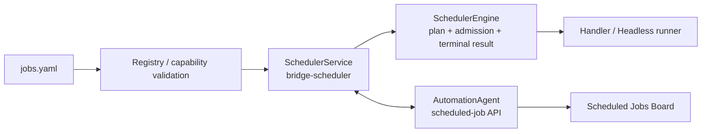

# Bridge 定时任务模块重构设计

> 2026-07-23 · 设计 v15 · 当前实现基线
>
> 本文取代 v14 中“仅控制面原型、尚未联调”的阶段性表述。它描述当前 Bridge 与
> AutomationAgent 已对齐的 Scheduler 契约、已迁移 Job、旧链路边界和后续迁移门槛。
> 本文不是“全部旧循环已经迁移”的声明。

## 1. 结论

Bridge 已引入一个独立、单实例、fail-closed 的 `SchedulerService`。它使用固定 Worker
`bridge-scheduler` 与 AutomationAgent 的 scheduled-job 控制面交互，负责：注册 definition、
计划计算、slot 准入、执行、终态上报、心跳与有界停止。

当前采用按 Job 原子迁移，而非替换整个 `jarvis_dingtalk_bot.py`：

1. 只有登记在 `bridge/scheduler/jobs.yaml` 的 Job 由新 Scheduler 运行。
2. 迁移一个 Job 必须同时交付 YAML definition、唯一 runner、测试，以及删除同名旧 tick。
3. 未登记的旧循环继续由原模块运行，禁止双触发或把其业务 cursor 塞进通用 job 表。
4. `daily.probe` 已迁入通用 Headless runner；默认停用，只验证注册和 Board 展示。
5. `AoneScheduler`、Aone reply、PR watch、daily nudge 与外部操作恢复尚未迁移；它们不是
   `daily.probe` 的兼容入口。

## 2. 当前运行边界

### 2.1 新 Scheduler 的职责



- `SchedulerService` 在 job 注册前注册固定 Worker，确认当前 `process_uuid` 为 ACTIVE，随后注册
  完整 YAML 快照并执行 interrupted recovery；任何一步不确定都不进入 tick。
- `SchedulerEngine` 同一 `job_key` 永不并发，不同 Job 最多使用
  `JARVIS_SCHEDULER_MAX_CONCURRENCY`（默认 4）个槽位。
- `SchedulerEngine` 只依赖控制面当前态；本地不把“已开始/已完成”当作最终真源。
- `bridge/scheduler.sh` 管理独立 Scheduler 进程。它不启动或停止普通 Task Worker，故不能据此
  宣称既有 Session/SubAgent 在 Bridge restart 时不间断。

### 2.2 旧链路仍承担的职责

| 组件 | 当前职责 | 是否已迁入 `jobs.yaml` |
| --- | --- | --- |
| `AoneScheduler` | 扫 Aone 并集、写入 `ticket` Task、处理 stale 观察 | 否 |
| `PersistenceExecutor` | lease Task、拉起可恢复 Session | 否；它是执行基础设施，不是定时 Job |
| `DailyScheduler` 的 `nudge` | 每日 idle 重访与 Terraform 超时催办 | 否 |
| `AoneReplyScheduler` | Aone 人工回复后唤醒 `SUSPENDED` Session | 否 |
| `PrWatchScheduler` | PR、CI、评审评论和合并后生命周期动作 | 否 |
| `ExternalOperationRecoveryScheduler` | 对不确定外部写操作做受 token 保护的只读收敛 | 否 |

`PersonaScheduler` 已并入 `AoneScheduler` 的 assignee/tracker/idle 并集扫描，不能作为新的
独立 Job 重新注册。旧 `DailyScheduler` 已不再包含 Probe 入口。

## 3. Job 注册表与配置契约

唯一注册表是 `bridge/scheduler/jobs.yaml`。它只列出已迁移 Job，修改后需要受控重启 Scheduler
才会重新登记到控制面。

```yaml
- key: <domain.action>               # 稳定 job_key，发布后不可改名
  revision: <positive-int>           # definition 语义变更时递增
  description: <中文说明>
  schedule: <interval | daily | adaptive>
  runner: <handler | headless>       # 唯一执行路由
  misfire: <compatible-policy>
  retry_delay_seconds: <positive-number>
  enabled: <boolean>
```

`enabled:false` 不是删除：definition 仍会注册，控制面状态为 `DISABLED`，Board 保留最近结果；
`next_run_at` 为 `null`。重新启用或任何执行语义变化必须提高 `revision`，禁止用旧 revision
覆盖已经登记的 definition。

### 3.1 调度类型与 misfire

| schedule | 可用 misfire | 语义 |
| --- | --- | --- |
| `interval` | `COALESCE` | 停机期间合并为一个待执行 slot |
| `daily` | `CURRENT_DAY` | 只补当天 Asia/Shanghai 的计划，不追补历史自然日 |
| `adaptive` | `COALESCE`、`WAIT_FOR_COMPLETION` | 由上次成功结果给出下一次时间，或等待在途完成 |

所有持久化时间使用 UTC；daily 的自然日与显示时区固定为 `Asia/Shanghai`。Slot identity 是：

```text
job_key + definition_revision + scheduled_for_utc
```

开始执行前控制面原子预留后续 `next_run_at`。间隔和 adaptive Job 在成功后可用真实结束时间修正
下一次计划。daily Job 的失败重试不得跨越下一日同一计划边界：当前控制面没有独立的原始 slot
字段，跨界时必须转为永久失败，避免把昨天的失败错误标记为明天的任务。

### 3.2 Runner 契约

| runner | YAML 关键字段 | 适用范围 | 要求 |
| --- | --- | --- | --- |
| handler | `handler_key`、可选 `payload` | 有界 Python 维护任务 | 不自行创建常驻线程或 sleep；注册时必须命中 handler catalogue |
| headless | `builder_ref`、`protocol`、`session_policy`、`lane` | 需要独立模型会话的任务 | builder/protocol 必须成对注册；未实现的 model override 直接拒绝 |

当前 Headless `session_policy` 取 `NEW` 或 `RESUME`，`lane` 取 `default` 或 `terraform`。一个请求的
内部瞬时重试复用稳定 session id；只有有本地 transcript 时才允许 resume。超时、错误轮数耗尽、
无结果或不符合协议的结果均 fail-closed。

`JobResult` 只有三种终态：`SUCCEEDED`、`RETRYABLE_FAILURE`、`PERMANENT_FAILURE`。成功可为
adaptive Job 交回带时区的 `next_due_at`；失败必须携带脱敏错误摘要，不能附带新的 next due。

## 4. 当前 Job 清单

| job key | schedule | runner | 启用状态 | 目的 |
| --- | --- | --- | --- | --- |
| `smoke.interval` | 60 秒 interval，立即执行 | `scheduler.smoke` handler | 启用 | 覆盖间隔计划、准入、结束上报；无业务副作用 |
| `smoke.daily` | 每日 10:00 | `scheduler.smoke` handler | 启用 | 覆盖 daily 当天补跑语义；无业务副作用 |
| `smoke.adaptive` | 30–120 秒，默认 60 秒 | `scheduler.smoke` handler | 启用 | 覆盖 adaptive 计划修正；无业务副作用 |
| `daily.probe` | 每日 10:00 | `probe.daily` / `probe-result-v1` headless | 停用 | 真实 Terraform 合成探测 |

Smoke Job 是新链路验收样例，允许在迁移后续真实业务 Job 前持续存在；它们不得创建业务数据。
当前控制面与 Board 应看到 4 条注册 definition，其中 `daily.probe` 显示“已停用 / 尚未运行”。

## 5. `daily.probe` 的独立 Headless 设计

Probe 不是普通 Aone Task，也不经过钉钉会话。每次调度创建一个新的 Terraform lane Headless 会话，
并按照以下顺序执行：

1. 执行运行环境 doctor 与 Tier-0 基线检查。
2. 按可用能力选择 Tier-1 合成客户场景；该阶段可能进行 Terraform 生命周期操作。
3. 执行清理、残留 sweep 与归档。
4. 只在证据充分时创建或去重 Aone finding。
5. 输出协议化结果，Scheduler runner 校验后把摘要原子写入
   `runs/probe/probe-YYYY-MM-DD-summary.md`。

Headless 最终输出必须含：

```text
[[PROBE_RESULT:{"outcome":"success","cleanup_ok":true,"summary":"..."}]]
```

`outcome`、`cleanup_ok` 和非空 `summary` 缺一不可。摘要落盘有有限重试；重试耗尽时标记
永久失败而不重新播放已可能产生外部副作用的探测。Probe 默认 `enabled:false`：真实启用需要
显式业务授权、提高 revision、重启 Scheduler 使定义生效，并在终态后再次以更高 revision 禁用。
由于使用 `CURRENT_DAY`，在当天 10:00 后首次启用会补跑当天一次，不能把这一行为误当作无副作用的
“只改配置”。

## 6. 控制面、Worker 与 Board

AutomationAgent 是 definition、当前状态、最近结果和 `next_run_at` 的真源。Bridge 通过：

```text
register → list/tick → start → complete | fail → recover-interrupted
```

与 scheduled-job API 交互。每个请求携带固定 `worker_key=bridge-scheduler` 和当前
`process_uuid`。控制面只接受 ACTIVE Worker 的当前进程；旧进程、重复启动、未知响应或 API 错误
都会被 Bridge 当作不可确认状态并停止调度。

Board 仅展示控制面当前态，不轮询 Bridge 内存，也不触发任何 Job。它至少展示：

- Scheduler Worker 的主机、状态、最后心跳和已注册 Job 数；
- 每个 Job 的中文 description、revision、周期、运行状态、计划时间和最近结果；
- 当 Worker 非运行时的全局提示：计划时间只是已登记计划，底下 Job 不会实际执行，直到 Worker
  恢复运行。

Board 对 description 使用控制面 `definition.description`。若 UI 显示的 description 与 API 定义不一致，
这是聚合/缓存映射问题；不能据此推断 Scheduler 使用了旧 definition。

## 7. 安全启动、停止与恢复

启动顺序：

```text
注册 bridge-scheduler ACTIVE
→ 校验 YAML registry 与 runner catalogue
→ 注册 definitions
→ recover-interrupted
→ READY
→ heartbeat + tick
```

计划内停止顺序：

```text
关闭新 slot admission
→ Worker=DRAINING
→ 等待所有在途 future 终态
→ Worker=OFFLINE
```

等待时间由 `JARVIS_SCHEDULER_DRAIN_TIMEOUT_SECONDS` 控制，默认 600 秒。超时不发送 SIGKILL，
取消本次 restart，恢复原进程的 ACTIVE 调度；只有 drain 完成后才能 OFFLINE 并启动替代进程。

异常崩溃时，启动阶段调用 `recover-interrupted`，将遗留 `RUNNING` 收敛到 `IDLE`，保留 admission
时预留的后续计划。它不恢复 Python 栈、外部调用半进度或任意 Headless 上下文；只有 runner 自己
定义并持久化的 checkpoint 才允许阶段性续跑。

## 8. 迁移规则与后续顺序

后续迁移采用“一个 Job、一个变更、一个验收面”：

1. 先把旧组件的 discovery、cursor、外部副作用和幂等边界拆清。
2. 实现单一 runner；任务发现继续先写 Task，外部发布继续使用既有 ledger/outbox。
3. 增加 YAML definition、revision、兼容的 misfire 与 Job 专项测试。
4. 删除同名旧 tick，确保任意时间点只有一个入口。
5. 在 Board、控制面状态与业务真源三处对账至少一个完整周期后，再删除遗留状态读路径。

建议顺序为：`daily.nudge` → `aone.reply` → `pr.watch` / `pr.lifecycle`。`AoneScheduler` 与
`ExternalOperationRecoveryScheduler` 的迁移要先单独设计，因为它们分别拥有 Task 生产、业务游标
和 recovery-token 约束；不能仅因“有循环”而套成 interval Job。

## 9. 验收

### 9.1 已覆盖

- registry 对重复 key、非法 revision、schedule/misfire 不兼容、未知 runner 和无 model override
  fail-closed；
- interval、daily、adaptive 的计划、slot identity、同 Job 不重叠、跨 Job 有界并发；
- 每日重试不跨下一计划边界；
- Scheduler 的 Worker 注册、心跳、interrupted recovery、drain 与取消 drain；
- `daily.probe` 的 Headless 协议解析、clean-up gate、摘要原子写入与旧入口隔离；
- 本地 Scheduler 启动后，控制面和 Scheduled Jobs Board 可观察到 4 个 definition、Worker 心跳及
  smoke Job 结果。

### 9.2 后续必验

- 每个真实业务 Job 迁移前，验证其旧入口已删除且业务 cursor、Task 与事件 ledger 无双写；
- 真实 Probe 仅在明确授权后执行，验证 Terraform 清理、Aone finding 去重和摘要归档；
- Scheduler 停止时 Board 必须清楚提示“已登记不等于正在调度”；恢复后确认计划重新推进；
- 多机/异常重启下验证唯一 ACTIVE `bridge-scheduler` 与 stale process fencing。

## 10. 代码布局

```text
bridge/
  main.py                         # Scheduler composition root
  scheduler.sh                    # start / stop / status
  headless/
    model.py                       # 通用 Headless 请求、尝试与结果契约
    runtime.py                     # 重试、resume 与 fail-closed 执行
    jarvis_adapter.py              # 对既有 Jarvis 命令执行层的窄适配
  scheduler/
    model.py                       # Job / schedule / runner / result
    registry.py                    # YAML 解析与能力校验
    engine.py                      # 计划、准入、执行与终态提交
    control_plane_client.py        # AutomationAgent HTTP 协议边界
    service.py                     # 固定 Worker、心跳、READY 与 drain
    jobs.yaml                      # 唯一已迁移 Job 注册表
    runners/
      smoke.py
      daily_probe.py
```

`jarvis_dingtalk_bot.py` 仍保留未迁移的旧调度循环及 Aone/Task 生命周期业务边界；通用
`bridge/headless/` 不依赖钉钉、Aone bookend 或具体 Probe 业务。

## 11. 不变的边界

- 调度控制面不代替 Task/Session 控制面。
- `jarvis_scheduled_job` 不保存通用 run history、执行 lease、Python checkpoint 或 Aone/PR cursor。
- Board 是只读观察面，不是 runner，也不能成为手动触发接口。
- 不因 Scheduler restart 承诺既有 PersistenceExecutor Session 不间断。
- Probe 的真实 Terraform 操作和 Aone finding 创建必须由业务授权前置；默认注册但不执行。
