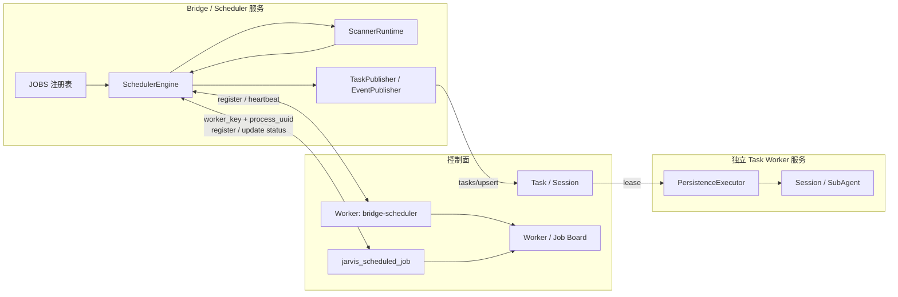

# Bridge 定时任务模块重构设计

> 2026-07-20 · 设计 v14 · 待评审
>
> 本版以 `origin/master@a44f934` 为唯一现状基线，取代 v1–v13 及
> `worktree-scheduler-refactor-design` 两条分叉方案。旧分支中的模型、注册表和
> `TriggerPlanner` 仅作为实现参考，不代表已进入主干或生产。

## 1. 结论

本次重构采用以下收敛方案：

1. Bridge 内只保留一个常驻 `SchedulerEngine`，所有时间驱动任务都通过显式 `JOBS` 注册表调度。
2. 调度器只运行扫描或可重放维护，不直接执行需要长期恢复的业务工作；业务工作继续写入现有 Task 控制面。
3. `PersistenceExecutor` 从 Bridge 拆成独立 Task Worker 服务。只有拆分完成后，才允许承诺 Bridge restart 不会终止正在运行的 Session/SubAgent。
4. job 定义、状态、最近结果和 `next_run_at` 保存到控制面单行当前态，供调度与 Board 展示；首版不在该表保存执行租约、通用 checkpoint 或 run 历史。
5. restart 采用 `QUIESCING → drain Scanner → Scheduler OFFLINE → 新实例 READY` 协议；Task Worker 不在 Bridge restart 的操作范围内。
6. Aone、Aone Reply、PR 生命周期均保持 at-least-once：先持久化 Task 或事件 WAL，再推进各 runner 自己的业务 cursor，禁止用内存状态作为完成依据。
7. Probe 继续是一次性 Ephemeral 作业，不扩展为 `probe_finding` Task；它受统一 Scheduler 管理，但不占用持久 Task Worker。

### 1.1 本轮实施边界（2026-07-21 收敛）

本轮先完成**整个调度控制面**，不将业务数据面迁入新框架。这里的控制面包括：

- `jarvis_scheduled_job` 的注册、当前态、恢复和 Board 只读展示；
- Scheduler 的 definition、slot admission、状态提交、停止接纳和控制面 HTTP 适配；
- Scheduler 的单实例运行控制、READY/OFFLINE 以及可观测性接口。

本轮不改 Aone/PR 的业务扫描、Task/Session 执行、业务 cursor、PR registry 或事件 ledger；
`PersistenceExecutor`/SubAgent 也不在本轮拆分。`daily.probe` 是唯一例外：它没有业务 cursor，
已迁入新 Scheduler 的独立 runner，并从旧 `DailyScheduler` 删除。其余数据面迁移仍采用独立的
旁路脚本：先导出、校验和回放，再在单独变更中原子切换。本轮不得宣称 Bridge restart 已保障
业务 Session/SubAgent 不间断。

### 1.2 唯一 Scheduler Worker

本轮的唯一 Scheduler 不新建表，也不向 `jarvis_scheduled_job` 增加 worker、run、lease、version
字段。复用控制面现有 Worker 注册记录，固定使用：

```text
worker_key = bridge-scheduler
capabilities.role = scheduler
capabilities.dispatch.pull = false
```

该 Worker 使用已有的 `host_id`、`process_uuid`、`status` 和 heartbeat 表示当前 Scheduler 进程。
`host_id` 只记录实际运行位置，不参与授权。Bridge 复用普通 Task 控制面 token 注册并保持
这条固定 Worker 记录，才允许注册或更新 scheduled job；每个
`register/start/complete/fail/recover` 请求均携带 `worker_key` 与 `process_uuid`，控制面只接受
当前 ACTIVE 的 `bridge-scheduler` 进程。

第一版不增加 Scheduler 专用 token 或额外鉴权。固定 `worker_key` 保证数据库只有一条 Scheduler
记录；当前进程默认每 30 秒发一次 heartbeat。旧进程未 OFFLINE 且 heartbeat 未超时前，新进程
注册必须返回冲突；正常迁移先将旧进程置为 OFFLINE，异常迁移等待心跳超时后接管。

job 不永久保存 Worker 外键。job 的定义和当前状态需要跨同一远端机器的进程重启保留；Worker
身份只在请求处理时校验。Board 单独读取固定 Worker 展示 Scheduler 状态。

固定 Worker 注册、心跳接管和 scheduled-job API 的 Worker/process 校验属于 C5；代码已提交，
尚未完成预发验证或部署。

## 2. 范围与非目标

### 2.1 目标

- 统一 interval、daily、adaptive 三类时间语义。
- 统一 job 注册、校验、slot admission、状态上报和可观测性；业务 cursor 继续由现有数据面负责。
- 控制面可恢复未完成 slot，但不触发或迁移 Aone/PR 的业务数据面。
- Board 可查看所有 job 的周期、当前状态、最近结果和下一次执行时间。
- 新增 job 时只增加控制面 definition、状态契约和测试；实际 runner 迁移留给旁路数据面方案。
- 只允许持有固定 `bridge-scheduler` Worker 身份的远端 Bridge 操作 scheduled job。

### 2.2 非目标

- 不新增 Scheduler 专用表、通用选主表或跨主机迁移；单实例身份复用已有固定 Worker 记录。
- 不把 Scanner run 建模为 Task、Session 或独立 Worker。
- 不新增 `scheduled_job_run` 历史表。
- 不改变现有 Task/Session 的业务状态机。
- 不把 Board、Executor 或人工触发命令注册成定时 job。
- 不在本次设计中把 Probe finding 持久化为 Task。
- 不向首版 scheduled-job 表添加 `current_worker_id`、`current_run_id`、lease、version 或通用扫描游标。
- 不在本轮修改 Daily/PR 本地 JSON、Task/Session、事件 ledger 或任何业务 cursor；也不以
  `jarvis_scheduled_job` 承载它们。
- 不在本轮把 `PersistenceExecutor` 拆成独立服务，或迁移既有 Aone/PR/Probe runner。

## 3. 当前主干基线

### 3.1 运行组件

当前 Bridge 是同一进程内的 6 个组件，其中 4 个组件各自维护调度线程：

| 当前组件 | 当前职责 | 当前时间/状态真源 | restart 行为 |
| --- | --- | --- | --- |
| `AoneScheduler` | 查询 `assignedTo ∪ tracker ∪ idle-tagged work items`；生成 `ticket` Task；低频检查 stale claim | 内存 snapshot、tick count；Task 控制面以 `desired_revision` 幂等 | 重启后全量重扫；Task upsert 收敛重复 |
| `DailyScheduler` | `nudge@09:00`、`probe@10:00` | `.my-day/bridge/daily-scheduler.json`；仅配置小时内到期 | 本地日期 marker 防当天重复；错过整小时不补跑 |
| `AoneReplyScheduler` | 查询控制面 `SUSPENDED + AONE_REPLY` Session；新评论生成 `wake` Task | 控制面 wait/cursor；内存仅用于轮询节流 | 可从控制面重建，不依赖本地 wait 文件 |
| `PrWatchScheduler` | PR 查询、CI/评论 Task、finish/comment/event 生命周期处理 | `.my-day/bridge/pr-watch.json`、Task 控制面、Aone/DingTalk 双 ledger | 本地 registry/cursor 与 ledger 跨重启恢复 |
| `PersistenceExecutor` | Worker 注册、heartbeat、Task lease、Session/SubAgent 生命周期 | Task/Session 控制面 | 与 Bridge 同进程；stop 会终止活动 Task 并转 retryable |
| `EphemeralExecutor` | 本地一次性作业，包括 probe | 进程内 inflight；部分结果写本地文件 | restart 时终止，不承诺跨重启去重 |

启动顺序是：

```text
PersistenceExecutor
→ AoneScheduler
→ DailyScheduler
→ AoneReplyScheduler
→ PrWatchScheduler
```

### 3.2 已完成的结构收敛

- 原 `PersonaScheduler` 已并入 `AoneScheduler` 的 assignee/tracker/idle 并集查询，不再是独立任务。
- 原 Scan、Revisit、Probe、WaitWatcher、ManagedWaitSensor、Reconcile、Board 等旧类已不再构成主干现状。
- 可恢复 Aone Reply 等待已经以控制面 Session/wait cursor 为真源。
- Task upsert、Worker/Session fencing、lease 和 retryable stop 已存在。
- PR 与每日任务已恢复本地持久状态，避免纯内存状态在 restart 后丢失。

### 3.3 尚未实现的能力

- 没有 `SchedulerEngine`、`JOBS` 注册表或统一时间循环。
- 没有 scheduled-job 注册/状态表、API 或 Board 查询。
- 没有 quiesce、Scanner drain、restart ID 或 READY 握手。
- Task Worker 尚未独立；Bridge restart 会中断活动 Session/SubAgent。
- `PrWatchScheduler` 仍混合 discovery、Task 生产和生命周期副作用。
- Daily 和 PR 状态仍依赖本地 JSON 文件，Board 无法统一展示 job 状态。

因此，当前只能保证“已持久化 Task 可重新 lease”，不能保证“Bridge restart 期间业务 Session 不中断”。

## 4. 目标架构



组件生命周期严格分离：

- Scheduler 服务：Bridge 入口、job 时间计算、Scanner 生命周期、job 状态提交。
- Scanner：由 Scheduler 创建的有界子进程或 handler；允许在 restart deadline 到达时终止。
- Task Worker：独立进程和 supervisor；只消费控制面 Task，不由 `bridge/run.sh restart` 停止。

## 5. 统一 Job 清单

v14 只迁移当前主干真实存在的时间驱动职责，不复活已删除组件：

| job id | 类型 | 目标 runner | 产物与副作用 | 迁移来源 |
| --- | --- | --- | --- | --- |
| `aone.scan` | interval / discovery | handler | 生成稳定 identity 的 `ticket` Task | `AoneScheduler` 主循环 |
| `aone.stale_claim` | interval / maintenance | command | 只发布有稳定 event key 的 stale 告警 | `AoneScheduler` 隐式 sub-tick |
| `daily.nudge` | daily / maintenance | handler | 通过现有双 ledger 发布幂等提醒 | `DailyScheduler` nudge |
| `daily.probe` | daily / discovery | headless | 一次性 Ephemeral 结果；不生成持久 Task | `DailyScheduler` probe |
| `aone.reply` | adaptive / discovery | handler | 生成稳定 identity 的 `wake` Task | `AoneReplyScheduler` |
| `pr.watch` | adaptive / discovery | handler | 生成 `pr_ci_fix` / `pr_comment_reply` Task，并把生命周期 intent 写入 durable ledger | `PrWatchScheduler` 查询与判断 |
| `pr.lifecycle` | adaptive / maintenance | handler | 消费 durable intent，执行 finish/comment/event 幂等发布与补偿 | `PrWatchScheduler` 生命周期副作用 |

约束：

- Persona 已合并进 `aone.scan`，不得再注册 `persona.*` job。
- Board 是 scheduled-job 当前态的消费者，不是定时 job。
- Executor 是执行基础设施，不是定时 job。
- `aone.stale_claim` 必须显式注册，禁止继续隐藏为第 N 次 scan 的 sub-tick。
- `daily.nudge` 和 `daily.probe` 必须拆成两个 definition，分别展示 next due 和结果。
- `pr.watch` 只发现变化和持久化 intent，`pr.lifecycle` 只消费 ledger；二者不得在同一 runner 中重新混合。

## 6. Job 开发契约

### 6.1 Definition

每个 `ScheduledJobDefinition` 必须声明：

| 字段 | 约束 |
| --- | --- |
| `id` | 稳定唯一，格式 `<domain>.<action>`，发布后不可复用 |
| `revision` | 正整数；扫描、输出或 checkpoint 契约变化时递增 |
| `description` | 明确扫描对象、目的和产物 |
| `purpose` | `DISCOVERY` 或 `MAINTENANCE` |
| `schedule` | interval、daily、adaptive 三选一 |
| `runner` | command、headless、handler 三选一 |
| `timeout_seconds` | 正数 |
| `retry_delay_seconds` | 可重试失败后重跑同一 slot 的间隔 |
| `replay_policy` | `TASK_UPSERT_IDEMPOTENT`、`EVENT_LEDGER_IDEMPOTENT` 或 `EPHEMERAL` |
| `enabled_env` | 可选，只决定业务是否启用；与新旧链路归属分离，只在 start/restart 时读取 |
| `checkpoint_upgrade` | `RESET_FULL`、`RESET_OVERLAP` 或 `MIGRATE` |

job 模块 import 时不得启动线程、访问网络、sleep 或写文件。`validate_registry()` 必须先把 iterable 单次物化为有序 tuple，校验后返回同一个 tuple；`load_jobs()` 直接返回校验结果。

`checkpoint_upgrade` 只描述 runner 自己的业务状态升级策略，不对应 `jarvis_scheduled_job` 字段。

### 6.2 Runner

| runner | 场景 | 约束 |
| --- | --- | --- |
| command | 确定性脚本或 CLI | argv 数组、workspace key、环境变量白名单；禁止 shell 字符串 |
| headless | 需要模型判断的扫描 | 固定 prompt builder、结果协议和 session policy |
| handler | 有界 Python 查询 | 显式 handler key；不得自行建线程或 sleep |

除 `EPHEMERAL` job 外，runner 不得直接启动业务 SubAgent。Discovery 结果应转换为持久 Task；Maintenance 外部副作用必须由现有 ledger 或等价 outbox 幂等保护。

### 6.3 Result

`JobResult` 固定包含：

- `status`：`SUCCEEDED`、`RETRYABLE_FAILURE`、`PERMANENT_FAILURE`。
- `observations`：仅成功结果允许非空。
- `checkpoint`：仅成功结果允许提供。
- `next_due_at`：仅 adaptive 的成功结果允许提供，且必须带时区。
- `error`：失败必填，成功禁止携带。

`JobResult.checkpoint` 由对应 runner 的业务状态接口消费，不写入通用 job 表。失败结果不得携带 observations、checkpoint 或新的 slot。协议非法时不发布 Task、不提交业务 cursor，并记录为永久协议错误。

## 7. 时间、slot 与失败语义

所有时间使用带时区 datetime；持久化统一使用 UTC，daily 的自然日固定为 `Asia/Shanghai`。

- 到期 admission：在 runner 启动前原子写入一个 fallback `next_run_at`，避免 runner 已启动但终态未回写时丢失后续计划。
- interval：使用绝对计划序列。admission 时预留第一个严格晚于 `started_at` 的计划时刻；成功后按真实 `completed_at` 再次修正，避免长任务形成无意义积压。
- daily：admission 时预留下一自然日同一时刻；当天到点后允许补跑，不追补更早自然日。
- adaptive：admission 时先写 `started_at + default_delay`；成功结果可用 `next_due_at` 修正。超出 min/max 边界是协议错误，禁止静默 clamp。
- retryable failure：使用真实失败时间加 `retry_delay_seconds` 覆盖 fallback 时间，形成新的重试计划。
- permanent failure：保留当前 slot，清空 retry due，等待更高 revision 或人工恢复。

slot key 固定由以下三元组生成：

```text
job_id + definition_revision + scheduled_for_utc
```

revision 升级不得复用旧 slot identity。旧分支的 `TriggerPlanner` 可移植为无 I/O 纯函数，但必须补齐 revision、失败状态和 adaptive 越界约束后才能使用；它本身不等于 `SchedulerEngine`。

## 8. 状态所有权与迁移

### 8.1 最终状态所有权

| 状态 | 最终真源 |
| --- | --- |
| definition、status、next due、最近结果 | `jarvis_scheduled_job` |
| runner 扫描游标、业务 checkpoint | 各 runner 现有持久状态；不进入首版通用 job 表 |
| Aone/PR 发现后的业务工作 | 现有 Task/Session 控制面 |
| Aone Reply 等待与 comment cursor | 现有 Session/wait 控制面 |
| Aone/DingTalk 发布去重与失败补偿 | 现有双事件 ledger；等价控制面 outbox 上线前不得删除 |
| Bridge pause | 本地运维开关，可保留 |
| PID、restart ID、READY | 本地进程握手文件，不作为业务恢复真源 |

`jarvis_scheduled_job` 一行代表一个已注册 job，同时保存 job 定义和当前运行状态。
详细属性统一放入 `definition` JSON；首版只展开调度和 Board 直接需要的字段：

| 字段 | 类型 | 含义与更新规则 |
| --- | --- | --- |
| `id` | `BIGINT UNSIGNED` | 数据库自增主键；只用于行标识，调度器不以它构造业务 identity |
| `job_key` | `VARCHAR(128)` | 稳定 job ID，例如 `aone.scan`；有唯一索引，是注册、状态更新和 Board 关联键 |
| `job_name` | `VARCHAR(256)` | 看板展示名称 |
| `definition` | `LONGTEXT` | definition JSON：revision、description、schedule、runner、timeout、retry 和 replay policy |
| `status` | `VARCHAR(32)` | `IDLE`、`RUNNING`、`ERROR`、`DISABLED`；是否正在运行直接看该字段 |
| `next_run_at` | `DATETIME(3)` | 下一次计划时间；当前 job admission 时提前推进，成功后可按真实完成时间修正 |
| `last_started_at` | `DATETIME(3)` | 最近一次开始执行时间 |
| `last_finished_at` | `DATETIME(3)` | 最近一次成功或失败结束时间 |
| `last_error` | `VARCHAR(2048)` | 最近错误摘要，不保存凭证或完整业务载荷 |
| `gmt_create` / `gmt_modified` | `DATETIME(3)` | 注册时间和最后更新时间 |

建表定义固定为：

```sql
CREATE TABLE jarvis_scheduled_job (
  id BIGINT UNSIGNED NOT NULL AUTO_INCREMENT COMMENT '主键 ID',
  job_key VARCHAR(128) NOT NULL COMMENT '稳定 job ID',
  job_name VARCHAR(256) NOT NULL COMMENT '看板展示名称',
  definition LONGTEXT NOT NULL COMMENT 'job definition JSON',

  status VARCHAR(32) NOT NULL DEFAULT 'IDLE'
    COMMENT 'IDLE/RUNNING/ERROR/DISABLED',
  next_run_at DATETIME(3) NULL COMMENT '当前待执行的计划时间',
  last_started_at DATETIME(3) NULL COMMENT '最近开始时间',
  last_finished_at DATETIME(3) NULL COMMENT '最近完成时间',
  last_error VARCHAR(2048) NULL COMMENT '最近错误摘要',

  gmt_create DATETIME(3) NOT NULL DEFAULT CURRENT_TIMESTAMP(3),
  gmt_modified DATETIME(3) NOT NULL DEFAULT CURRENT_TIMESTAMP(3)
    ON UPDATE CURRENT_TIMESTAMP(3),

  PRIMARY KEY (id),
  UNIQUE KEY uk_job_key (job_key),
  KEY idx_schedule (status, next_run_at)
);
```

`definition` 示例：

```json
{
  "revision": 1,
  "description": "扫描工作项并生成持久化 Task",
  "schedule": {"type": "interval", "seconds": 1800},
  "runner": {"type": "handler", "key": "aone.scan"},
  "timeoutSeconds": 300,
  "retryDelaySeconds": 30,
  "replayPolicy": "TASK_UPSERT_IDEMPOTENT"
}
```

状态字段按以下规则更新：

| 场景 | `status` | `next_run_at` | 时间与错误字段 |
| --- | --- | --- | --- |
| 首次注册 | `IDLE` | 首次计划时间 | 三个最近结果字段均为空 |
| 到期开始 | `RUNNING` | admission 时预留的下一次时间 | `last_started_at=now`，清空 `last_error` |
| 成功完成 | `IDLE` | 保留 fallback，或按真实完成时间修正 | `last_finished_at=now`，清空 `last_error` |
| 可重试失败 | `ERROR` | 重试时间 | `last_finished_at=now`，记录错误摘要 |
| 重试开始 | `RUNNING` | admission 时再次预留下一个 fallback | `last_started_at=now`，清空 `last_error` |
| 永久失败 | `ERROR` | `NULL` | `last_finished_at=now`，记录错误摘要 |
| 异常中断恢复 | `IDLE` | 保留 admission 时已预留的下一次时间 | 不恢复 Python 栈；到预留时间后重新执行 |
| 禁用 | `DISABLED` | `NULL` | 保留最近一次运行结果 |
| 重新启用 | `IDLE` | 重新计算计划时间 | 保留最近一次运行结果 |

每次启动只对 YAML 中已迁移的 `JOBS` 做 upsert：已存在的 job 更新 `job_name` 和 `definition`；未出现在 YAML 的旧任务不进入新控制面，也不会被注册为 `DISABLED`。

不新增 run-history 表；历史运行明细继续由日志和 Task/Session 时间线承担。

### 8.2 本地状态迁移

首版 job 表不承载业务 cursor/checkpoint。本地业务状态迁移仍采用“固化、双读校验、切换、延迟删除”，禁止先删本地文件。已迁移的
`daily.probe` 没有业务状态文件；它以 Scheduler 的运行结果和重试状态为唯一调度状态。其余 job 遵循：

1. `DailyScheduler` 的日期 marker 继续作为 daily runner 的独立业务状态，不能塞入 `jarvis_scheduled_job`。
2. `pr-watch.json` 的 registry、cursor 和 dedupe 状态继续由 PR runner 所有，后续需要控制面化时使用独立业务状态接口。
3. 迁移期旧 loop 和新 job 不得同时触发；`bridge/scheduler/jobs/jobs.yaml` 只列出新链路 job，
   同时驱动其注册和同名旧入口屏蔽；未列出的 job 完全由旧模块负责。`enabled_env` 只决定
   已迁移 job 的业务启停。
4. 连续两个完整周期对账一致并确认新的业务状态真源后，才停止读取旧状态文件。
5. 双事件 ledger 在等价 durable outbox 验收前继续保留，不能随 scheduler 状态文件一起删除。

### 8.3 控制面渐进迁移与旧链路兼容

首版允许旧定时任务模块与新 `SchedulerEngine` 同进程共存，以 job 为最小迁移单元；这不是双写或
双触发模式。当前只有 `daily.probe` 走新链路，其余 job 仍走旧链路。运维只可编辑一个显式 YAML
注册表把 job 切到新链路：

```text
# 在 bridge/scheduler/jobs/jobs.yaml 新增目标 Job 的完整 definition，且声明
# engine_runner: <Bridge runner 名称>
```

YAML 中的 job 仅由新 Engine admission，旧模块必须删除同一 job 的旧 tick；未列出的 job 仅由旧模块执行，
不进入新控制面。已迁移 job 仍须满足 definition 的 `enabled_env`，业务开关关闭时不执行。未知 job、
重复项、仍配置已废弃的
`JARVIS_SCHEDULER_ENABLE`/`JARVIS_SCHEDULER_JOB_*`，或缺少新 runner 映射，均在启动阶段
fail-closed。这样只需编辑一个变量即可逐项迁移，且路由归属与业务启停不会相互覆盖。

本轮迁移只替换**调度控制路径**。job 原有的业务 cursor、daily marker、PR registry 和 event ledger
仍由旧 runner 持有；D1 的数据面导出、迁移、对账和删除旧状态文件仍不在本轮范围。

## 9. Task 与事件不丢失契约

### 9.1 Aone scan

- 冷启动允许全量重扫。
- `task_key` 与 `desired_revision` 必须稳定；重复发现由 Task upsert 收敛。
- Task 全部明确 accepted 后才能推进 runner 自己的 scan cursor。
- 网络超时或 ACK 未知时不推进业务 cursor，下一轮以相同 identity 重提。

### 9.2 Aone Reply

- 控制面 Session/wait cursor 是唯一真源。
- 通用 job 表不保存 checkpoint；控制面 wait cursor 仍是唯一恢复依据。
- restart 后重新分页查询全部 pending wait；相同评论生成相同 `wake` Task identity。

### 9.3 PR watch 与生命周期事件

- PR registry/cursor 保留在 PR runner 的独立持久状态中；重复扫描生成相同 Task identity。
- finish、评论、Aone/DingTalk 通知必须先写带稳定 semantic event key 的 ledger/outbox，再允许推进业务 cursor。
- Aone 与 DingTalk 独立记账、独立重试；一个通道成功不得抑制另一个通道补偿。
- `post_uncertain` 只能查 marker，不得盲目重发。

### 9.4 Probe

- `daily.probe` 为 Ephemeral，唯一执行入口为 `scheduler/jobs/daily_probe.py`；旧 `DailyScheduler`
  不再定义、注册或调用 probe。
- 计划内 restart 必须等待本轮完成，异常崩溃可以中断本轮；可重试失败由 Scheduler 按 definition 的
  `retry_delay_seconds` 重试，不写 local daily marker。
- Probe 不使用 PersistenceExecutor，不引入 `probe_finding` Task。

## 10. 安全 restart

### 10.1 生效前置条件

以下条件全部完成前，`bridge/run.sh restart` 只能声明“可重租”，不能声明“Session 不间断”：

1. `PersistenceExecutor` 已迁出 `JarvisHandler`，由独立 `task_worker.py/task_worker.sh` 与 supervisor 管理。
2. Scheduler Scanner 容量与 Task Worker 容量静态分区，合计不超过机器预算。
3. Bridge stop/restart 不向 Task Worker 或其 sentinel 发送信号。
4. Task Worker 的启动、heartbeat、lease、stop 和 crash recovery 已独立验收。

### 10.2 正常 restart 协议

```mermaid
sequenceDiagram
    participant CLI as run.sh restart
    participant Old as Old Scheduler
    participant Scan as Scanner
    participant CP as Control Plane
    participant New as New Scheduler
    participant TW as Task Worker

    CLI->>Old: QUIESCING(restart_id)
    Note over TW: 持续运行，不接收 stop
    Old->>Old: admission lock 内关闭 trigger gate
    Old->>Scan: drain active runs
    alt 完整链在 drain deadline 前完成
        Scan-->>Old: JobResult
        Old->>CP: Task/Event durable ACK
        Old->>CP: update terminal status; refine next_run_at when needed
        Old->>CP: Scheduler Worker OFFLINE
        CLI->>New: start(restart_id)
        New-->>CLI: READY(restart_id)
    else drain deadline 到达
        Old->>CP: restore Scheduler Worker ACTIVE
        Note over Old: 取消本次 restart，恢复调度
        Note over CLI,New: restart 失败；不得启动新进程
    end
```

固定顺序：

1. 生成 restart ID，旧 Scheduler 进入 `QUIESCING`。
2. 在 admission lock 内关闭 trigger gate，不再启动新 Scanner。
3. Worker 标记为 `DRAINING` 后不得 admission 新 slot，但相同 `process_uuid` 的在途 job 可以继续
   `complete/fail`，完成“结果校验 → Task/Event durable ACK → 更新 status/next_run_at”完整提交链。
4. drain deadline 默认 600 秒，可由 `JARVIS_SCHEDULER_DRAIN_TIMEOUT_SECONDS` 调整。到期时不杀
   Scanner、不标记 OFFLINE、不启动新进程；restart 返回失败，旧进程恢复 ACTIVE 并继续调度。
5. 所有 active Scanner 完成后，旧 Scheduler 标记 OFFLINE 并退出。
6. 旧进程退出后才启动新 Scheduler；只有收到相同 restart ID 的 READY，restart 才返回成功。

launchd 不得直接用 `kickstart -k` 跳过 quiesce/drain；必须先完成协议，再由 supervisor 拉起新进程。

### 10.3 固定 Scheduler Worker 与中断恢复

控制面使用已有 Worker 表的一条固定记录 `bridge-scheduler` 表示唯一 Scheduler。Scheduler
启动先使用普通 Task 控制面 token 注册该 Worker（`capabilities.role=scheduler`），并以已有
`process_uuid` 与 heartbeat 保持当前进程身份。`bridge/run.sh` 的本机 PID 只用于本机进程管理，不是
跨机器的 Scheduler 授权依据。

Scheduler composition 在首次 job 注册前必须完成以下顺序：

1. 使用 `JARVIS_CONTROL_PLANE_TOKEN`（缺省回退 `JARVIS_HTML_REPORT_TOKEN`）注册固定
   `bridge-scheduler` Worker；
2. 确认控制面返回的 Worker 为当前 `boot_id`、`process_uuid` 且为 ACTIVE；
3. 在每个 scheduled-job API 请求中携带该 `worker_key` 和 `process_uuid`；控制面在同一事务内校验；
4. 注册完整 `JOBS` 快照；
5. 首次 `list/tick` 前显式执行 interrupted recovery。

固定 Worker、心跳接管与 scheduled-job API 的 Worker/process 校验已提交，尚未完成预发验证。

新实例完成 job `register` 后、首次 `list/tick` 前，composition 必须显式调用一次控制面
`POST /api/jarvis/v1/scheduled-jobs/recover-interrupted`。该调用返回严格的
`{ "recovered": number, "jobs": [...] }`：`recovered` 必须与 `jobs` 数量相等，且每个
返回 job 均为保留 admission 时已预留 `next_run_at` 的 `IDLE`。HTTP、JSON 或响应契约不确定时 fail-closed，
不得进入普通 tick。`SchedulerEngine.tick()` 不自动调用恢复，避免未完成启动协调的轮询意外
改写控制面 `RUNNING` 状态。

计划内 restart 不产生需要恢复的半途 job。只有进程崩溃、机器重启或人工强制终止等异常中断，
才把遗留 `RUNNING` 归一为 `IDLE`，保留 admission 时已写入的后续计划。控制面
不保存 Python 调用栈、局部变量或外部 API 的半完成状态，因此首版本不承诺从任意代码位置继续。

后续断点续跑只采用 job-owned checkpoint：每个 job 自己定义持久化阶段、cursor、升级策略和
恢复入口，在完成 checkpoint 的 durable ACK 后推进。未声明 checkpoint 能力的 job 不从任意
代码位置继续，不向 `jarvis_scheduled_job` 增加
通用 checkpoint 字段。

服务端等价状态归一：

```sql
UPDATE jarvis_scheduled_job
SET status = 'IDLE',
    last_error = 'scheduler interrupted before completion'
WHERE status = 'RUNNING';
```

该更新不修改 `next_run_at`；该值已在 admission 时推进，job 到预留时间后再次执行。job 表保持当前
字段；Worker 身份由每次请求的 `worker_key + process_uuid` 校验，不写入 job 行。

## 11. Board 与可观测性

控制面 Worker/运行状态页面增加 Scheduled Jobs 区域，每个 job 展示：

| 字段 | 展示要求 |
| --- | --- |
| job | `job_key`、`job_name`、description、revision |
| schedule | interval/daily/adaptive 摘要与时区 |
| current | `status`；`RUNNING` 即当前正在执行，`DISABLED` 即已禁用 |
| next | `next_run_at`；RUNNING 时也展示已预留的后续计划；永久失败或禁用时明确显示原因 |
| latest | `last_started_at`、`last_finished_at`、duration、`last_error` |

Board 只读控制面当前态，不通过轮询 Bridge 内存拼装，也不触发 job。Scheduled Jobs 区域之外，
Board 还应展示固定 `bridge-scheduler` Worker 的 `host_id`、status、最近 heartbeat 与
`process_uuid`；该展示属于 C5，当前未实现。

## 12. 代码结构

```text
bridge/
  run.sh
  main.py                         # Bridge/Scheduler composition root
  task_worker.py                  # 独立 Task Worker composition root
  task_worker.sh                  # 独立 supervisor 入口
  scheduler/
    model.py                      # definition / schedule / result
    planner.py                    # 纯时间计算 TriggerPlanner
    engine.py                     # 唯一 loop / admission / restart recovery
    runtime.py                    # ScannerRuntime / publishers
    jobs/
      __init__.py                 # 显式 JOBS 注册表
      aone_scan.py
      aone_stale_claim.py
      daily_nudge.py
      daily_probe.py
      aone_reply.py
      pr_watch.py
      pr_lifecycle.py
    tests/
      test_model.py
      test_registry.py
      test_planner.py
      test_engine.py
      test_runtime.py
      test_restart.py
      test_<job>.py
```

原子切换后，`jarvis_dingtalk_bot.py` 不再定义定时循环。钉钉事件入口与 Scheduler composition 可以同服务，但不得重新持有 Task Worker。

## 13. 实施阶段

主干当前只有 B0 完成；旧设计分支的 J1/J2 原型不计入实施状态。

| 阶段 | 当前状态 | 交付与完成门 |
| --- | --- | --- |
| B0 | 已完成 | 组件 10→6、Aone 并集探测、控制面 wait、PR/每日本地持久状态 |
| U1 | 已提交，待合入 | Bridge Job definition、显式 `JOBS` registry、`TriggerPlanner` 和契约测试已在 Bridge MR `28675904`。 |
| U2 | 已提交，待预发验证 | `jarvis_scheduled_job` 已创建；AutomationAgent Code Review `28719590` 包含注册、状态 API、恢复和 Board Scheduled Jobs 展示。该 Code Review 尚未完成 Java 21 预发验证。 |
| U3 | 已提交，待预发联调 | Bridge MR `28675904` 已包含 import-safe `SchedulerEngine`、`ScannerRuntime`、slot admission、真实结束时间计算、终态幂等重试，以及独立的 `scheduler/jobs/daily_probe.py` runner；`daily.probe` 已注册到新链路且旧 `DailyScheduler` 入口已删除。 |
| C4 | 已提交，待预发联调 | Bridge MR `28675904` 已包含标准库 HTTP adapter：register/list/start/complete/fail/recover-interrupted、UTC 时间编解码、`start` 原子预留下次时间及异常 fail-closed。AutomationAgent Code Review `28719590` 的 `start` 接收 `{scheduledFor,nextRunAt}` 并返回 `{admitted,job}`。两端尚未完成预发联调。 |
| C5 | 已提交，待预发联调 | Bridge 已实现固定 `bridge-scheduler`、复用普通 Task token、`boot_id + process_uuid` 注册确认、30 秒 heartbeat、`dispatch.pull=false`、以 `bridge/scheduler/jobs/jobs.yaml` 统一驱动 Job 注册与旧入口屏蔽、READY/OFFLINE 和有界计划内 drain；超时取消 restart 并恢复 ACTIVE。AutomationAgent 已提交单 Worker 活跃进程冲突、既有 Worker timeout 接管、DRAINING 在途终态提交和 Board Worker 展示。`host_id` 只用于展示和迁移追踪；Scheduler 不进入普通 Task queue-pull Worker 集合。该阶段不停止或重启 Task Worker。 |
| C6 | 未开始 | 控制面预发验证：重复启动拒绝、心跳超时接管、slot admission、interrupted recovery、Board 展示和控制面不可用 fail-closed。 |
| D1 | 部分实施 | `daily.probe` 已迁移，无业务状态文件需要旁路迁移；Daily nudge、PR 与 Aone 的业务状态和 runner 仍需导出、校验、回放、对账与原子切换，单独评审。 |

执行顺序：

```text
U1 → U2 → U3 → C4 → C5 → C6
```

C4–C6 只完成控制面。D1 及独立 Task Worker/数据面验收前，禁止对外宣称 Bridge restart 保持业务 Session/SubAgent 不间断。

## 14. 测试与验收门

本轮只执行 14.1 中与控制面有关的门禁：状态 API、HTTP adapter、slot admission/recovery、Board
和控制面不可用 fail-closed。14.2、14.3 是后续 D1 数据面迁移的验收清单，不构成本轮阻塞项。

### 14.1 契约测试

- registry 重复 ID、revision/digest 不一致、非法 runner 和 import 副作用必须失败。
- fake clock 覆盖 interval、daily 补跑、adaptive 边界、misfire 和同 slot retry。
- slot identity 必须包含 revision；失败结果不得生成下一 slot。
- 同 job 禁止 overlap，不同 job 允许在容量内并发。
- Task/Event 未明确 durable ACK 时，runner 的业务 cursor 不推进。
- 控制面不可用必须 fail-closed；遗留 `RUNNING` 在启动时恢复为保留已预留后续计划的 `IDLE`。
- 只有当前 ACTIVE 的 `bridge-scheduler` Worker 的 `worker_key + process_uuid` 可调用
  scheduled-job 状态 API；过期进程或重复启动必须被控制面拒绝。

### 14.2 后续数据面迁移回归（D1，非本轮）

- Aone 全量重扫不产生 Task storm，相同 `desired_revision` 幂等收敛。
- Aone Reply restart 后从控制面恢复全部等待与 cursor。
- Daily marker 导入后，当天不重复；错过整点可在当天补跑。
- PR registry/cursor 导入后不漏 PR；事件 ledger 重放不重复发布。
- Bridge 正常运行时 Probe 异常不标记成功，并按真实失败时间进入重试计划。
- 每个迁移 job 都证明旧 loop 与新 job 不会同时触发。

### 14.3 后续跨数据面 restart 验收（D1 之后，非本轮）

预发必须分别注入以下故障：

1. Scanner 扫描中注入进程崩溃；计划内 restart 另行验证会等待 Scanner 完成。
2. Task upsert 成功、job 状态更新前 restart。
3. PR/Aone 事件写 ledger 后、发布前 restart。
4. Scheduler crash，无正常 OFFLINE。
5. 控制面短时不可用。
6. 多个业务 Session 运行时 Bridge restart。

通过标准：

- 未完成 Scanner 对应的 `RUNNING` 被恢复为 `IDLE`，保留 admission 时已预留的后续计划。
- Aone/PR 更新没有被 runner 的业务 cursor 越过。
- 重复 Task/事件由稳定 identity 收敛。
- 旧 Scheduler 完全退出后新实例才进入 READY，不存在两个 Scheduler 同时写 job 状态。
- Task Worker PID、sentinel 和活动 Session 在 Bridge restart 前后保持不变。
- 计划内 `run.sh restart` 只有在旧 Scheduler drain 完成且新 Scheduler READY 后返回成功；drain
  超时时返回失败且不启动新进程。

## 15. 评审问题的明确回答

1. **Board 如何看调度？** 读取 `jarvis_scheduled_job` 当前态，展示 job、周期、状态、最近结果和 next due；Board 本身不是 job。
2. **PersonaScheduler 与 ScanScheduler 是否合并？** 已合并。当前主干由 `AoneScheduler` 做 `assignedTo ∪ tracker ∪ idle-tagged work items` 并集探测；v14 只保留 `aone.scan`。
3. **Bridge restart 是否会杀 SubAgent？** 当前会；数据面独立与 Session 不间断不在本轮控制面范围，D1 后单独验收。
4. **Aone/PR 更新会不会在 restart 时丢失？** 不会依赖通用 job checkpoint：Task 或事件 ledger/outbox 必须先获得 durable ACK，runner 才推进自己的业务 cursor；未知 ACK 使用相同 identity 重放。

## 16. 最终通过条件

本轮控制面完成以以下条件为准：

1. `jarvis_scheduled_job` 的 register/list/start/complete/fail/recover 契约在预发可用，且 Board 只读展示当前态。
2. Bridge 以生产 HTTP adapter 注册并读取 job 状态；stale/duplicate slot 被拒绝时不执行 runner，控制面不可用时 fail-closed。
3. 只有当前 ACTIVE 的 `bridge-scheduler` Worker 可以调用 scheduled-job API，每个请求校验
   `worker_key + process_uuid`。复用普通 Task token，`host_id` 不参与授权。
4. Scheduler 可完成单实例的 READY/OFFLINE 与 admission quiesce；它不操作 `PersistenceExecutor`、Task、Session 或旧业务 loop。

以下十项是原始的**全量目标**，保留为后续 D1 数据面迁移与独立 Task Worker 的验收条件，不代表本轮交付完成门：

方案实施完成必须同时满足：

1. 所有生产定时职责都来自唯一 `JOBS` 注册表，不存在隐藏 sub-tick 或自建永久调度线程。
2. 7 个 job 的 schedule、状态、next due 和最近结果可在 Board 查询。
3. `jarvis_scheduled_job` 只保存注册定义和当前状态；admission 先推进后续计划，遗留 `RUNNING` 可在启动时恢复为 `IDLE`。
4. Aone/PR discovery 使用 at-least-once 与稳定 Task identity；事件使用稳定 ledger/outbox key。
5. 任一未明确 durable ACK 的 Task/事件都不会被业务 cursor 越过。
6. 计划内 Scheduler restart 在有界时间内等待 Scanner 完成，超时取消 restart 并恢复旧进程；
   异常中断时未完成 job 保留 admission 时已预留的后续计划。后续只有声明 job-owned checkpoint
   的 job 才允许从持久化阶段继续。
7. 独立 Task Worker 不被 Bridge restart 操作，活动 Session/SubAgent 实测不中断。
8. 首版只有一个活动 Scheduler；旧进程未退出或新实例未 READY 时 restart 不成功。
9. Daily/PR 各自业务状态完成固化和双读对账后才停止读取旧文件；事件 ledger 在等价 outbox 上线前不删除。
10. 原子切换后无旧调度入口、双触发和过期架构文档。
